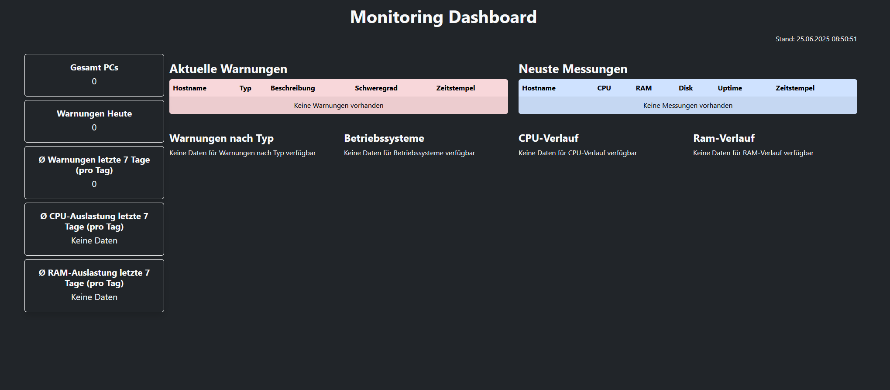
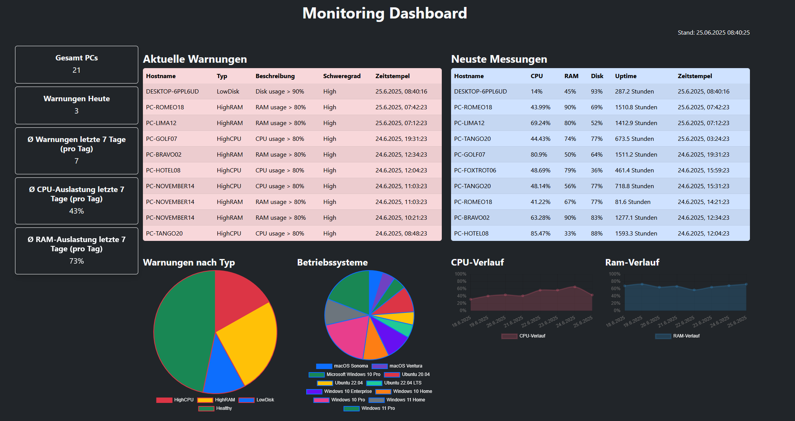
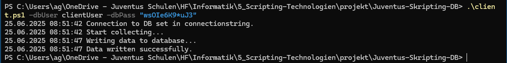
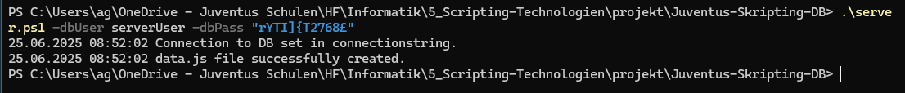
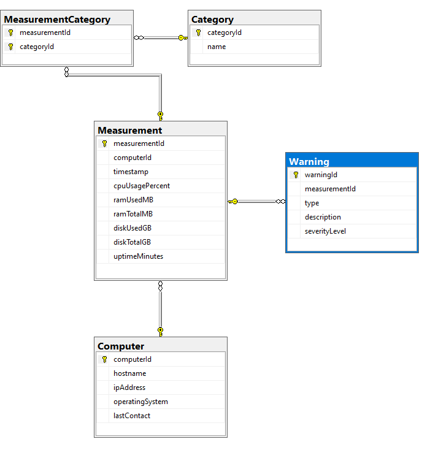

# Screenshots

## Leeres Dashboard (Keine Daen in DB)

## Dashboard mit einigen Daten in DB

## Ausführung Client Sript

## Ausführung Server Sript

## Datenbank Diagramm

## Architektur

# Client-Skript (client.ps1)

- Prüft auf Adminrechte
- Misst: CPU-Auslastung, RAM-Verbrauch, Festplattenspeicher, IP-Adresse, Uptime, OS
- Führt automatische Messung via Task Scheduler aus
- Sendet Werte via Stored Procedures an MS SQL-Datenbank
- Unterstützt Parameter wie -silent zur Steuerung der Konsolenausgabe

# Server-Skript (server.ps1)

- Prüft auf Adminrechte
- Liest aggregierte Daten via Views
- Erstellt ein data.js-File mit allen Messwerten & Warnungen

# HTML Dashboard (site.html)

- Übersicht über:
  - Aktuelle Warnungen
  - Neuste Messungen
  - Verteilung der Betriebssysteme
  - CPU/RAM-Verlauf über 7 Tage
- Übersichtliche Darstellung mit Bootstrap CSS und Chart.js
- Auto-Refresh alle 60 Sekunden (greifft auf data.js zu, muss natürlich von server js geupdated werden)

# Datenbankstruktur

Die relationale SQL-Datenbank ist normalisiert in 3. NF und enthält:

- 5 Tabellen
  - Computer, Measurement, Warning, Category, MeasurementCategory (m:n-Beziehung)
- Referenzielle Integrität
  - mit ON DELETE/UPDATE CASCADE
- Stored Procedures & Trigger
  - Automatische Warnungen bei Überschreitung (CPU > 80%, RAM > 80%, Disk > 90%)
- Views
  - z. B. vw_DashboardSummary, vw_AvgCpuUsageLast7Days

# Testdaten (fakedata.sql)

- Enthält 20 PCs mit verschiedenen Betriebssystemen
- Erstellt 100 Messwerte mit zufälligen, realistischen Lastwerten
- Löst automatisch Trigger & Warnungen aus
- Perfekt geeignet für Live-Demo & Tests

# Tools & Technologien

| **Komponente** | **Tool / Technologie**                 |
| -------------- | -------------------------------------- |
| Skripting      | PowerShell                             |
| Datenbank      | Microsoft SQL Server Express           |
| Frontend       | HTML, CSS, Bootstrap, Chart.js         |
| Deployment     | Windows Task Scheduler                 |
| IDE            | Visual Studio Code + PowerShell Plugin |

# Hinweise

Bei produktivem Einsatz sollten Sicherheitsaspekte wie SQL-Injection, sichere Passwörter, Rollen etc. berücksichtigt werden.

Die HTML-Datei kann auf jedem Webserver (auch lokal via file://) verwendet werden.
